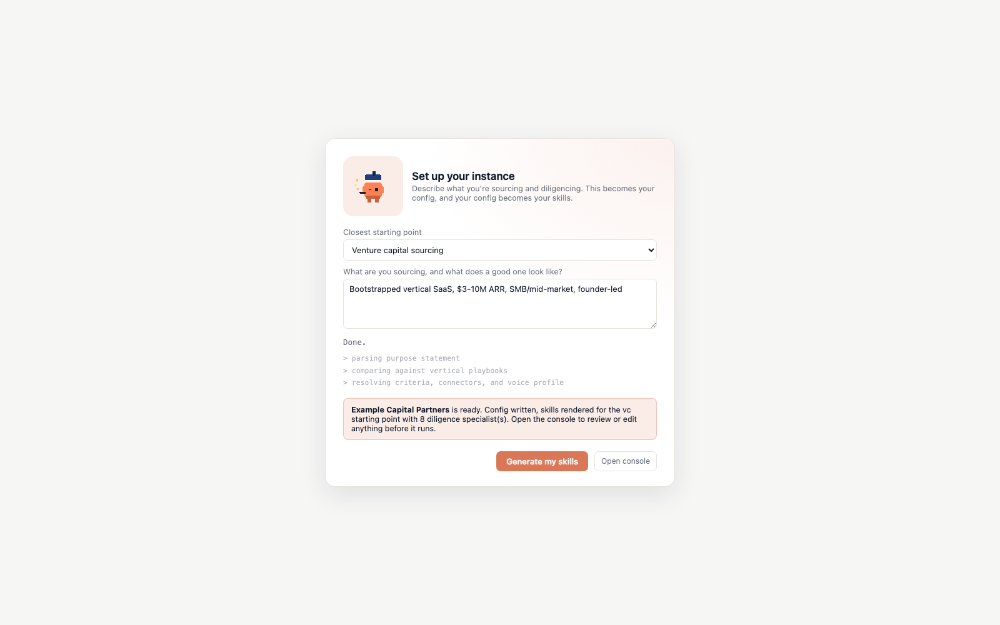
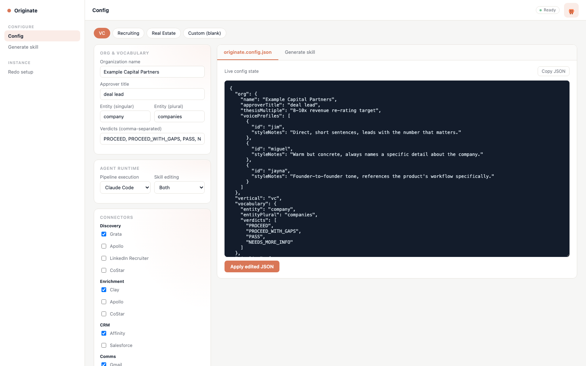
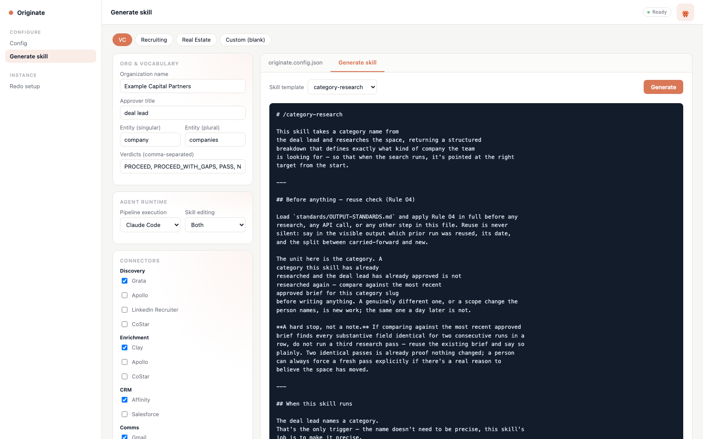

# Originate — AI Sourcing & Diligence Copilot

Originate is a configurable pipeline for finding, qualifying, enriching, and
reaching out to a universe of targets — companies, candidates, properties,
prospects, or submissions — with a human approving anything risky before it
happens. It also runs a document-driven diligence pipeline: specialist
reviews of a locked set of documents, ending in an enforced decision memo.

Venture capital sourcing is the flagship vertical (see
`templates/verticals/vc/`, which encodes an example firm's criteria as the
reference example), but the pipeline underneath is vertical-agnostic — see
`docs/VERTICAL-PLAYBOOKS.md` for recruiting, real estate, corp dev, sales
development, and insurance underwriting.

## Try it: the Originate console

The fastest way to understand this project is to run its local console — a
real, working browser app (no build step, no dependencies) that walks
through setting up a tenant and rendering the actual `.claude/skills/*`
files that setup produces.

```bash
git clone https://github.com/jaynappatel/originate.git
cd originate
npm run console          # or: python3 -m http.server 4173
```

Then open **http://localhost:4173/app/index.html**.

### First run: setup, before anything else loads

You don't land in the main console first. You land on a setup screen: pick
the closest starting point (VC, recruiting, real estate, or blank), describe
in your own words what you're sourcing and what a good one looks like, and
click **Generate my skills**. Watch the character work through it — reading
what you described, matching it against the closest vertical, then writing
your config and rendering your skills — before the console itself unlocks.



This mirrors how the real thing is meant to work: you don't hand-edit
`.claude/skills/*` files yourself. You describe your purpose, and an
assistant turns that into the config and the generated skills, and only then
do you get access to run anything.

### The console itself

Once setup finishes and you click through, you get the actual working
surface: a sidebar for org details, vocabulary, agent runtime (Claude Code
or Codex — for pipeline execution and for skill editing independently), and
which connectors are wired to each pipeline role, plus a top bar with a live
status indicator.



The **`originate.config.json`** tab shows the live config state as you edit
it, and can be edited directly as raw JSON — this is the same file a
chat-based setup assistant would be editing on your behalf.

The **Generate skill** tab is the interesting part: pick any of the 9 core
skill templates, click **Generate**, and the console fetches the matching
`templates/core/<skill>/SKILL.md.tmpl`, resolves every `{{placeholder}}`
against your current config, and shows you the exact `SKILL.md` a real
tenant would get. Picking `diligence-specialist` adds a second dropdown to
choose which configured specialist to render.



The screenshots above are real output, not mockups — that's the actual
`category-research` skill, rendered against the VC starter config, produced
by `app/engine.js`, a small template renderer implementing the mechanical
substitution spec'd in `cli/README.md`'s `originate generate` command.

### Deep links

Any console view can be shared or bookmarked directly, skipping the setup
screen:

```
index.html?vertical=recruiting&tab=generate&skill=score-entities&autogen=1
```

`vertical` picks the starter config, `tab=generate` opens the preview tab,
`skill` pre-selects a template, and `autogen=1` renders it immediately.

### What this console does — and doesn't — do

It's a real, client-side config editor and template renderer: everything
above actually runs in your browser against the real files in this repo,
nothing is mocked. What it does **not** do yet: write the rendered skills
to disk as an actual tenant workspace, call any real connector, or execute a
pipeline. Those are the desktop shell, the `originate` CLI, and the
execution engine described in `cli/README.md` — the next phase past this
console.

## Why this exists

An existing production sourcing/diligence system already proved the
pipeline shape, the permission model, and the checkpointing engineering
work — but everything that made it specific to one company was hardcoded:
the scoring rubric lived in three files kept in sync by a test, the
connectors were a fixed set, and onboarding assumed one person at one firm.
Originate is that same proven engine, generalized so any company can
configure it for their own criteria, their own connectors, and their own AI
runtime, through a guided setup instead of hand-edited source. It's a new,
standalone project — it doesn't depend on or modify whatever it was
generalized from.

## Read next

- **`docs/ARCHITECTURE.md`** — the full design: what generalizes, what
  doesn't, the config schema, the template system, and the onboarding flow.
- **`docs/VERTICAL-PLAYBOOKS.md`** — seven company archetypes and how each
  maps onto the pipeline.
- **`docs/CONFIG-SCHEMA.md`** — annotated walkthrough of
  `originate.config.json`.
- **`docs/CONNECTOR-CATALOG.md`** — the connector registry: what a connector
  declares, and the starting catalog.
- **`docs/ONBOARDING-FLOW.md`** — the 8-step guided setup, including the
  Claude Code vs. Codex choice.
- **`cli/README.md`** — spec for the deferred `originate` CLI (init,
  configure, generate, validate, run) that would replace this browser
  console with a real local pipeline.

## Repo layout

```
app/           the Originate console — index.html, style.css, app.js, engine.js, pet.js
docs/          design documents and the console screenshots
schema/        originate.config.schema.json — the JSON Schema for a tenant's config
templates/
  core/        9 universal, vertical-agnostic SKILL.md templates
  verticals/   thin overlays per company archetype (vc, recruiting, real-estate)
  connectors/  the connector registry — one directory per data source / tool
standards/     generalized OUTPUT / EVIDENCE / WRITING / GROUNDING rules
cli/           spec for the `originate` CLI (init/configure/generate/validate/run)
```
